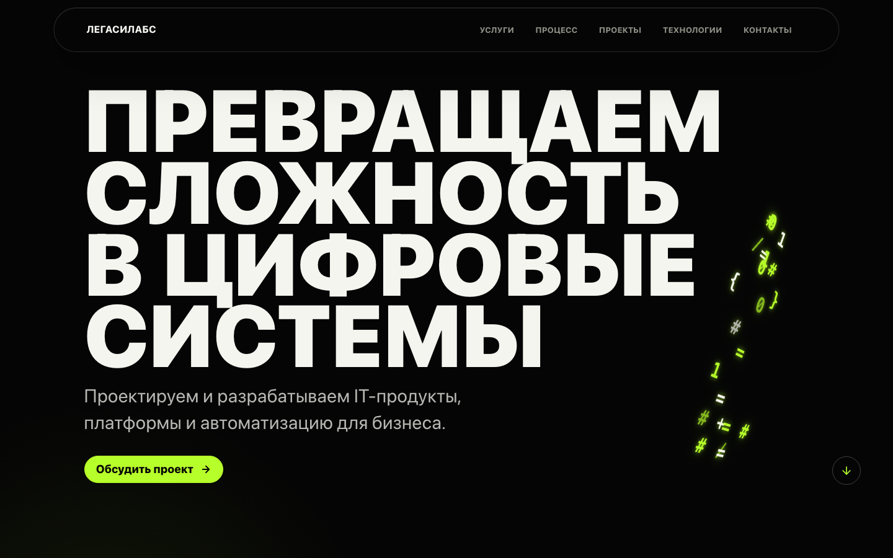
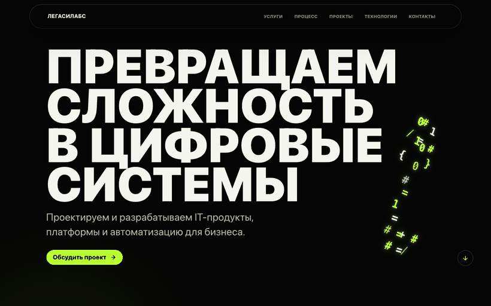
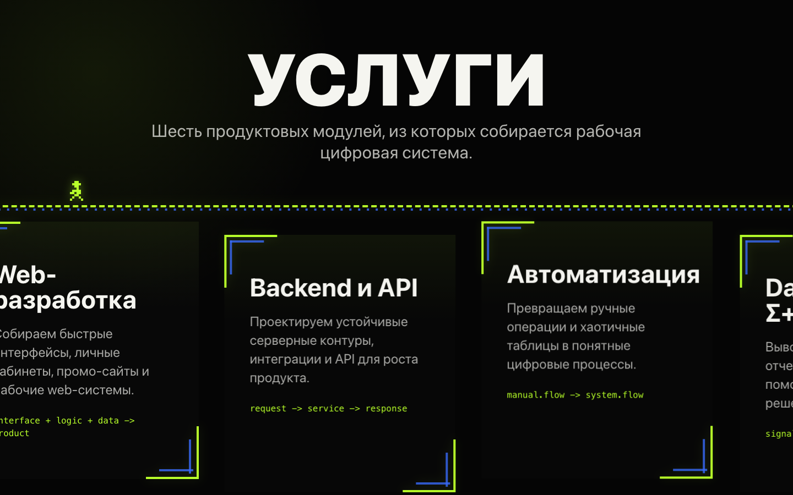
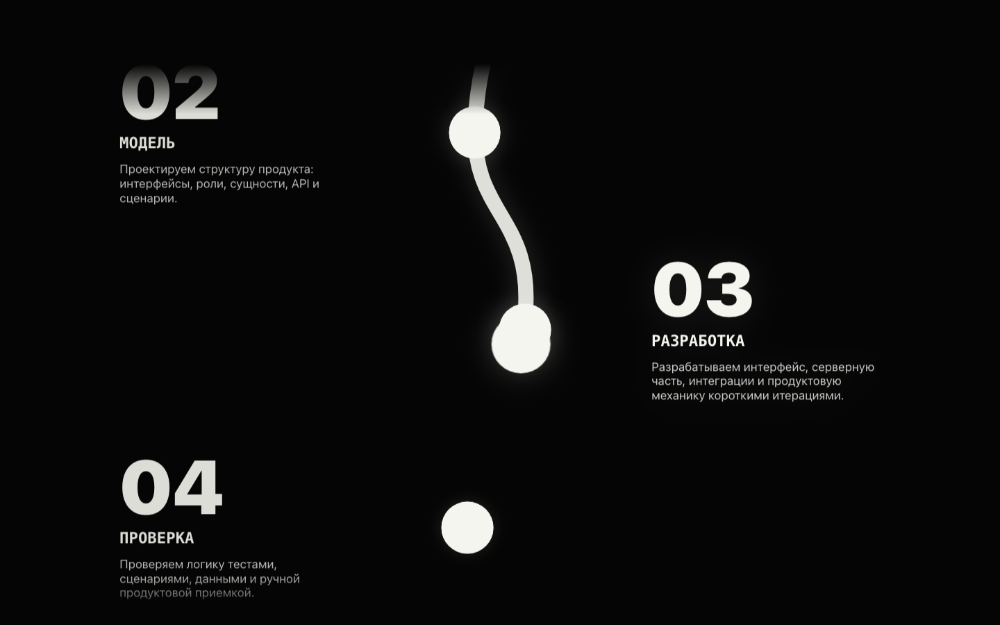
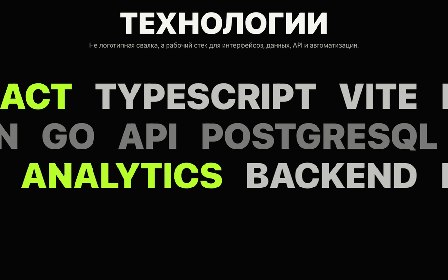

# ЛЕГАСИЛАБС

Промо-сайт IT-команды, собранный как эксперимент: я сделал проект с помощью ИИ, без глубоких знаний frontend-языков и без ручного написания каждого блока с нуля.

Главная идея проекта — показать, что современный сайт можно собрать через постановку задачи, итерации, визуальные правки и проверку результата. Я выступал как автор идеи, постановщик требований и ревьюер, а ИИ помогал проектировать интерфейс, писать код, исправлять ошибки и приводить структуру к нормальной архитектуре.

## Preview











## Что получилось

- Темный one-page сайт для IT-компании.
- Большой постерный первый экран с ASCII/key art.
- Блок услуг с пиксельным персонажем, который двигается по дорожке при скролле.
- Анимированный блок процесса с точками и линией прогресса.
- Блок проектов с первым продуктовым кейсом AgroPlanner.
- Бесконечные строки технологий.
- Контактная форма в demo-режиме без отправки данных наружу.
- Адаптивная верстка и поддержка `prefers-reduced-motion`.

## Почему это важно

Этот репозиторий для меня не просто “еще один лендинг”. Это пример того, как человек без уверенного знания React, TypeScript, Three.js и GSAP может довести интерфейс до рабочего состояния через AI-assisted development.

Я не пытался изображать, что сам наизусть знаю весь стек. Вместо этого я управлял результатом:

- формулировал, каким должен быть сайт;
- выбирал визуальное направление;
- проверял, что не нравится в браузере;
- просил переделывать конкретные блоки;
- требовал архитектурного порядка;
- запускал проверки и добивался рабочей сборки.

ИИ в этом проекте был не “кнопкой сделать сайт”, а инструментом разработки: как быстрый инженер рядом, которому нужно правильно ставить задачу и внимательно принимать результат.

## Стек

- React 19
- TypeScript
- Vite 8
- React Three Fiber
- Three.js
- GSAP ScrollTrigger
- React Hook Form
- Zod
- Vitest
- Testing Library
- ESLint

## Архитектура

Проект приведен к Feature-Sliced Design:

```text
src/
  app/        # инициализация приложения, глобальные стили, motion layer
  pages/      # страницы
  widgets/    # крупные секции страницы
  features/   # пользовательские сценарии, например форма заявки
  entities/   # сущности: услуги, процесс, проекты
  shared/     # конфиг, хуки, переиспользуемый UI
```

Такой разнос нужен, чтобы сайт можно было развивать дальше: добавлять реальные контакты, новые кейсы, CMS, блог или продуктовые страницы без хаоса в `components`.

## AI workflow

Проект собирался итеративно:

1. Сначала было техническое задание для сайта компании.
2. Потом выбрано визуальное направление: темный “cipher poster”.
3. Дальше через браузер проверялись блоки, анимации, отступы, меню, адаптив и настроение.
4. После визуальных правок код был разложен по FSD.
5. Финально прогнаны проверки: lint, тесты и production build.

Главный вывод: ИИ хорошо ускоряет разработку, но не заменяет вкус, требования и контроль качества. Если не проверять результат глазами и тестами, получится просто случайная генерация.

## Запуск

```bash
npm install
npm run dev
```

Локально сайт откроется на:

```text
http://localhost:5173/
```

## Проверки

```bash
npm run lint
npm run test -- --run
npm run build
```

На момент публикации все проверки проходят.

## Что можно улучшить дальше

- Подключить реальную отправку формы.
- Заменить placeholder-контакты на боевые.
- Добавить страницу кейса AgroPlanner.
- Подготовить production deploy.
- Сделать Lighthouse-проход и добить метрики.

## Автор

Deckardic  
GitHub: [github.com/Deckardic](https://github.com/Deckardic)
